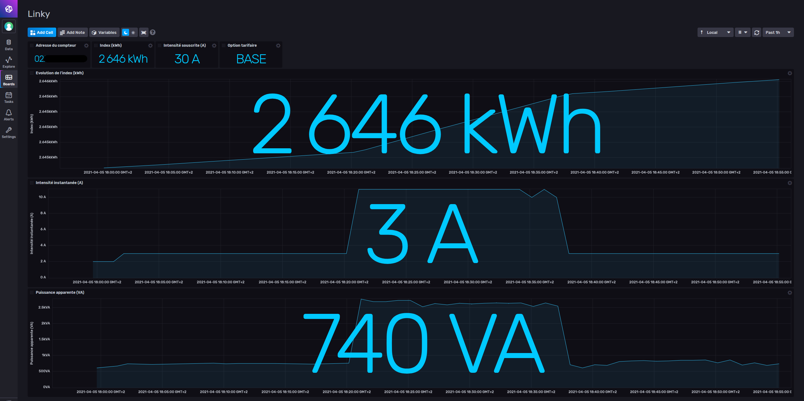

# Introduction
This Python 3 script is used to collect data from a Linky electric meter via serial port, on a RaspberryPi (model zero in my case)
Data is then sent to a local InfluxDB v2 bucket.

# Files

## collect_linky.py
Python v3 script, used to collect data from Linky meter and to send it to InfluxDB v2

## dashboard.json
Dashboard for InfluxDB v2

# RaspberryPi configuration

In my case, I chose to use a RaspberryPi Zero, in headless configuration.

I assume here that you already set the basics on your RaspberryPi:
- You can remoteley access your RaspberryPi via Wifi (https://www.raspberrypi.org/documentation/configuration/wireless/wireless-cli.md)
- SSH is enabled (see https://www.raspberrypi.org/documentation/remote-access/ssh/)


## Configure serial port

## Install prerequisites

You will need pip for Python3 if not already installed
`sudo apt install python3-pip`

InfluxDB client library for Python3
`python3 -m pip install influxdb-client`

PySerial library for Python3
`python3 -m pip install pyserial`

pytz library for Python3 (if not already installed)
`python3 -m pip install pytz`

# Hardware requirements
https://www.tindie.com/products/Hallard/pitinfo/


# InfluxDB configuration

Buckett
Token

# InfluxDB dashboard


You can import this dashboard in your InfluxDB via the web UI (import the content of the JSON file dashboard.json)
This dashboard will show you your current contract informations
*Note: labels and descriptions are in French, as this is a French electrical meter.*

# Python script explanations

- [ ] Detail each value

```python
if (isAwesome){
  return true
}
```

# Useful documentation

For details on the Linky meter, especially the serial data (chapter 6): https://blog.bigd.fr/wp-content/uploads/2018/01/Enedis-NOI-CPT_54E.pdf
